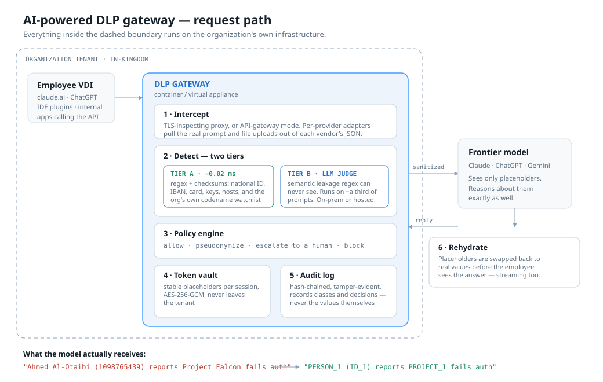

# Hajiz — AI-powered DLP gateway

**SAIF 2026 · Cybersecurity & Defensive Technologies track**

An enterprise gateway that sits between employees and frontier AI models. It reads every
outbound prompt and file, finds the sensitive parts with a deterministic layer and an LLM
judge, replaces them with stable placeholders, forwards the sanitized request — and puts
the real values back into the answer before the employee sees it.

> We don't trade productivity for protection. We decouple them.

---

## The problem

Enterprises want their people using Claude and ChatGPT. Security teams can't allow it,
because a prompt is an unlogged, unclassified, free-text egress channel straight out of
the perimeter. Both usual answers are bad: block everything and you get shadow AI on
personal phones with zero visibility; allow everything and customer PII, source code and
unannounced deals walk out the door with no record that it happened.

Classic DLP was built for files and email. It cannot judge a sentence like
*"our unreleased Falcon platform has an auth bypass in the SSO module"* — no pattern
matches it, and it is the most damaging thing an employee could paste.

## What makes this different

Every product in this space **masks**: it replaces the value with `[REDACTED]` and the
model loses the context it needed, so the answer gets worse and people route around the
tool. Hajiz **pseudonymizes reversibly**:

```
Employee types : Customer Ahmed Al-Otaibi (ID 1098765439) reports that Project Falcon
                 fails auth on login.
                        ↓ tokenize — mapping stays in the tenant
Model receives : Customer PERSON_1 (ID ID_1) reports that PROJECT_1 fails auth on login.
                        ↓ the model reasons about PERSON_1 / PROJECT_1 perfectly well
Employee sees  : the full answer, with Ahmed Al-Otaibi, 1098765439 and Project Falcon
                 restored — including mid-stream, token by token.
```

The same value gets the same placeholder for the whole session, so a multi-turn
conversation stays coherent. The mapping never leaves the organization.

**Saudi angle:** PDPL and the NCA controls make cross-border transfer of personal data a
legal question, not a preference. The semantic judge is pluggable — point it at a model
running on the organization's own hardware and no prompt text leaves the Kingdom at all,
not even for the classification step.

---

## Quickstart

No API key needed. Mock mode synthesizes the upstream reply locally, so the entire
pipeline is demonstrable with no network at all.

```bash
npm install
DLP_UPSTREAM_MODE=mock npm start
```

On **Windows PowerShell**, environment variables are set separately and `&&` does not
work — use one line per command:

```powershell
npm install
$env:DLP_UPSTREAM_MODE="mock"
npm start
```

Then open <http://localhost:8080> for the dashboard, and in another terminal:

```bash
node scripts/demo-client.js --scenario 1
```

The four scenarios walk the four decisions:

| # | Scenario | Decision |
|---|----------|----------|
| 1 | Support ticket with a name, national ID, phone and an internal codename | **pseudonymize** — sent sanitized, answer restored |
| 2 | Debugging help with a live API key and a database connection string | **block** — never leaves the network |
| 3 | Board talking points about an unannounced acquisition | **escalate** — held until a human approves in the dashboard |
| 4 | An ordinary encryption question | **allow** — untouched |

Add `--stream` to any of them to watch placeholders get restored mid-stream.

### Running against the real API

```bash
export ANTHROPIC_API_KEY=sk-ant-...
npm start
node scripts/demo-client.js --scenario 1 --stream
```

```powershell
$env:ANTHROPIC_API_KEY="sk-ant-..."
$env:DLP_UPSTREAM_MODE="live"
npm start
```

Any existing client works unchanged — point its base URL at the gateway:

```bash
ANTHROPIC_BASE_URL=http://localhost:8080 your-existing-app
```

---

## How it works



**Tier A** is regex plus checksums: Saudi national ID and Iqama (Luhn check digit), IBAN
(mod-97), payment cards, provider API keys, private keys, connection strings, internal
hostnames and RFC1918 addresses, and the organization's own watchlist of project
codenames. Sub-millisecond, and it carries most real traffic.

**Tier B** is an LLM judge that only runs when there is prose long enough to hide
something a pattern cannot see. It returns spans, classes, confidence and a rationale
under a strict schema; the text it classifies is wrapped as untrusted data, and every span
it reports is located in the original text by the gateway itself, so a hallucinated span is
simply dropped.

This two-tier split is the answer to the first question anyone asks: *doesn't an LLM call
on every prompt destroy your latency?* It doesn't, because most prompts never reach Tier B.

**The policy engine** maps each class to one of four actions — `allow`, `pseudonymize`,
`escalate`, `block` — with per-group overrides, and the strictest finding decides the
request. A low-confidence judge finding is escalated to a human rather than acted on
silently. The whole control surface is one readable [`policy.yaml`](policy.yaml), hot-reloaded
on save.

**The audit log** is hash-chained: each record carries the hash of the one before it, so
editing or deleting a past decision breaks the chain and `/api/audit/verify` says exactly
where. It records classes, detectors and decisions — never the sensitive values it protected.

---

## The on-prem judge, and the demo stand-in

The semantic judge is the one component that has to read the sensitive text, so it is the
component the data-residency argument lives or dies on. It speaks plain OpenAI-compatible
HTTP, so it runs against anything the organization hosts itself — vLLM, Ollama, LM Studio,
llama.cpp:

```powershell
$env:DLP_JUDGE_PROVIDER="local"
$env:DLP_JUDGE_BASE_URL="http://llm.internal:8000/v1"
$env:DLP_JUDGE_MODEL="google/gemma-4-26b-a4b-it"
npm start
```

Startup then reports `residency   in-tenant — llm.internal`, and no prompt text reaches any
third party, including for classification.

**For a demo without standing up a GPU**, the same open model hosted on OpenRouter can
stand in for the in-tenant one. The code path is identical — same protocol, same prompt,
same parsing — only the hostname differs:

```powershell
$env:DLP_JUDGE_PROVIDER="local"
$env:DLP_JUDGE_BASE_URL="https://openrouter.ai/api/v1"
$env:DLP_JUDGE_MODEL="google/gemma-4-26b-a4b-it:free"
$env:DLP_JUDGE_API_KEY="sk-or-..."
npm start
```

The gateway works out for itself whether the judge is genuinely in-tenant, and refuses to
flatter the setup: a judge on a public hostname is reported as `external` and marked
**STAND-IN** in the startup banner, in `/api/state`, and in amber in the dashboard footer —
even though the provider is set to `local`.

That is deliberate. During a demo with the hosted stand-in, prompt text *does* leave the
network, which is the opposite of what the product claims. Say so on the slide. A judge who
notices it before you mention it has caught you overselling; a judge who hears you declare
it sees a team that understands its own threat model.

Because small open models are much looser than a frontier model about output format, the
local path is deliberately tolerant: servers that reject `response_format` get a retry
without it, JSON is extracted from markdown fences and surrounding prose, `class` is
accepted for `cls`, and an invented category is kept as `other` rather than dropped. A
reply that cannot be parsed at all degrades loudly — it never passes as "clean".

## Repo map

```
gateway/
  server.js              HTTP server, dashboard, SSE, admin API
  config.js              every knob, all environment-driven
  proxy/
    adapters.js          Anthropic + OpenAI request/response/stream shapes
    handler.js           the request pipeline
    sse.js               streaming frame parser
  detect/
    tierA/               patterns, checksum validators, overlap resolution
    tierB/judge.js       the semantic judge (Anthropic SDK, or on-prem)
    index.js             tier orchestration and the Tier B trigger rule
  policy/policy.js       policy.yaml loader and the decision engine
  vault/vault.js         tokenization, rehydration, streaming, AES-256-GCM
  audit/audit.js         hash-chained append-only log
dashboard/               live split-screen UI
bench/                   labeled corpus + precision/recall/latency harness
test/                    41 tests, including full end-to-end through the server
docs/                    architecture diagram, demo script
```

## Configuration

| Variable | Default | What it does |
|---|---|---|
| `DLP_PORT` | `8080` | gateway port |
| `DLP_UPSTREAM_MODE` | `live` | `mock` synthesizes replies locally — no network, no key |
| `DLP_JUDGE_PROVIDER` | `anthropic` | `local` talks to any OpenAI-compatible on-prem server |
| `DLP_JUDGE_MODEL` | `claude-opus-5` | the judge model |
| `DLP_JUDGE_BASE_URL` | — | point the judge at in-tenant infrastructure (or a hosted stand-in) |
| `DLP_JUDGE_API_KEY` | `ANTHROPIC_API_KEY` | credential for the judge, separate from the upstream one |
| `DLP_JUDGE_EFFORT` | `low` | classification doesn't need deep reasoning |
| `DLP_VAULT_KEY` | ephemeral | 32-byte hex; without it mappings die with the process |
| `DLP_POLICY` | `./policy.yaml` | policy file location |
| `DLP_DASHBOARD_PLAINTEXT` | `true` | **demo only** — sends pre-sanitization text to the dashboard |
| `DLP_ESCALATION_TIMEOUT_MS` | `90000` | how long a held prompt waits for a reviewer |

Request headers: `x-dlp-session` scopes the placeholder vault, `x-dlp-group` selects
policy overrides.

---

## Measured results

```
npm run doctor    # what is configured, and does the judge actually answer
npm test          # 51 tests
npm run bench     # detection benchmark, Tier A only (no API key needed)
```

`npm run doctor` is the first thing to run when the judge misbehaves: it prints the
environment, the resolved configuration, masked credentials, the judge's residency, and
then makes one real call and reports what came back. Most judge problems are a variable
set in a different terminal, and this shows that in a line.

Against the bundled corpus (32 prompts, 14 of them deliberately benign). The two tiers
are scored separately, because they are separate claims.

**Tier A — deterministic**

| | |
|---|---|
| precision / recall (strict class) | 100.0% / 100.0% over 19 expectations |
| false positives on clean prompts | 0 of 14 |
| latency | p50 0.02 ms · p95 1.2 ms |

**Tier B — two judges, same corpus, same harness, 3 runs each**

The semantic tier is pluggable, and two very different models were measured
under identical conditions: a generative judge that writes spans, and a
*decision* model that only ever chooses among options it is given.

| | Gemma 4 26B (generative) | Jev 1.13 (decision) |
|---|---|---|
| precision / recall (span level) | 91.7% / **100%** | 90.9% / 90.9% |
| precision / recall (strict class) | 90.3% / 84.8% | 88.9% / 72.7% |
| recall variance across 3 runs | 81.8% – 90.9% | **flat** |
| false positives on 15 clean prompts | 0 | 0 |
| latency p50 / p95 | 952 ms / 2965 ms | **407 ms / 510 ms** |
| span width (mean) | 32 chars | 96 chars |

Neither dominates. Gemma finds more; Jev is 2.3x faster at the median, 5.8x at
p95, and returns **the same findings every run** - `spans returned 14 – 14`
against Gemma's 12–13 and a recall that swung nine points between runs. For an
auditable control, "these specific things, every time" is a different claim from
"82–91% depending on the run".

The structural difference shows in span width. A generative judge returns
phrases, which can be substituted. A decision model picks whole sentences,
which can only be escalated - so policy routes semantic findings to a human
rather than pseudonymizing them, because substituting a fact does not protect
it anyway.

Jev cannot hallucinate a span: its options are sentences we split and spans
Tier A already located, so a fabricated finding is not filtered out afterwards,
it is inexpressible. Its confidence is calibrated rather than self-reported,
which is what the policy thresholds branch on.

**Detail below is the generative judge** (`google/gemma-4-26b-a4b-it`, 3 runs, 99 calls, 0 degraded)

| | |
|---|---|
| precision / recall (span level) | 91.7% / 100.0% over 11 expectations |
| precision / recall (strict class) | 90.0% / 81.8% |
| false positives on clean prompts | 0 of 15 |
| stability | 30 of 30 expectations found in **every** run; identical findings all 3 runs |
| latency | p50 1.4 s · p95 3.1 s |

Combined across both tiers: precision 96.6%, recall 93.3%, F1 94.9%.

**The gap between span-level and strict-class recall is entirely class disagreement, not
missed data.** Both cases — a product name classed as `vulnerability`, a financial phrase
classed as `strategic` — were detected; the judge simply chose a neighbouring category.
Note the direction of those errors: both categories map to `escalate` rather than
`pseudonymize`, so every classification mistake in this run failed *toward* human review.
For a security control that is the right way to be wrong.

Span-level ignores the class and asks only whether the sensitive text was found — that is
what decides whether data leaks. Strict also requires the class to match, which is what
decides whether the right policy action fires.

**Read all of this honestly:**

- The corpus is small and hand-built. It is a regression harness and a starting point for
  a real evaluation, not a claim about production accuracy.
- **Two of Tier B's three false positives are unresolved labeling judgments**, not
  detector errors — see `labelingNotes` in [bench/corpus.json](bench/corpus.json). Rule on
  them and precision moves substantially. The number is only as good as the labels.
- **Stability was measured within one run set, not across sessions.** The three runs above
  returned identical findings, but a span caught in an earlier session's runs was missed in
  a later one. Say "stable within a run set", never "deterministic" — Tier A is the only
  layer that earns that word.
- **The judge prompt was revised three times against this corpus** (a missing
  `vulnerability` category, then an ambiguous description of it). Each change fixed a real
  specification gap, but three iterations against 33 hand-written samples is where fitting
  the benchmark starts replacing fitting reality. Further gains need new data written by
  someone who has not seen the judge's wording — not more prompt edits.
- The strongest number here is the least glamorous one: **zero false positives on clean
  prompts, in both tiers.** False alarms on prompts that are already being sanitized cost
  almost nothing; false alarms on ordinary work are what make people route around a
  security control.
- Tier B latency is measured against a shared hosted endpoint. An in-tenant GPU is the
  production answer and would be materially faster.

## What is built, and what is not

Built and working end to end: API-gateway interception for Anthropic and OpenAI shapes,
both detection tiers, reversible pseudonymization including streaming rehydration,
the policy engine with group overrides, human-in-the-loop escalation, the hash-chained
audit log, the live dashboard, mock mode, the benchmark, and the test suite.

Deliberately **not** built — described as the productionization roadmap:

- **TLS-inspecting interception of the web UIs** (claude.ai, chatgpt.com in a browser).
  API-gateway mode proves the pipeline; the MITM proxy plus per-site request adapters is
  the larger engineering effort and adds nothing a stage demo can show.
- **On-prem model hosting.** The judge is pluggable and the `local` provider is
  implemented, but no model is bundled or benchmarked.
- GPO/PAC deployment tooling, SIEM connectors, SSO and RBAC for the dashboard.
- File coverage beyond plain text — PDF, DOCX and images with OCR.

## Limitations worth stating out loud

- **This governs managed egress.** An employee on a personal phone is out of scope, and
  no gateway can fix that. What it fixes is the traffic an organization can actually see.
- **The judge is a model, so it is wrong sometimes.** That is why low-confidence findings
  escalate to a person, why Tier A handles anything deterministic, and why the policy file
  decides what a wrong answer costs.
- **Pseudonymization is not anonymization.** A prompt can stay re-identifiable through
  context alone; the placeholder removes the identifier, not the story around it.
- **The dashboard shows plaintext in demo mode.** In a real deployment that is off — the
  whole point is that the plaintext never travels anywhere.
- **The judge path has not been exercised against the live API in this environment**
  (no credentials were available). Its logic is unit-tested — span location, class
  constraints, hallucination rejection, degraded fallback — but verify it yourself with
  `npm run bench -- --judge` before putting a number on a slide.
